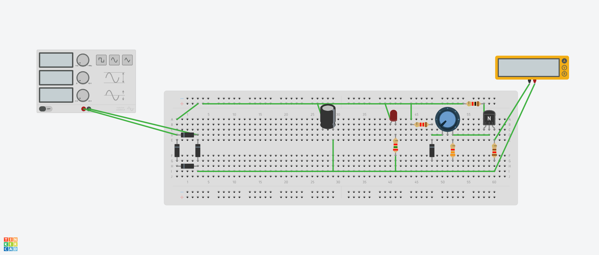
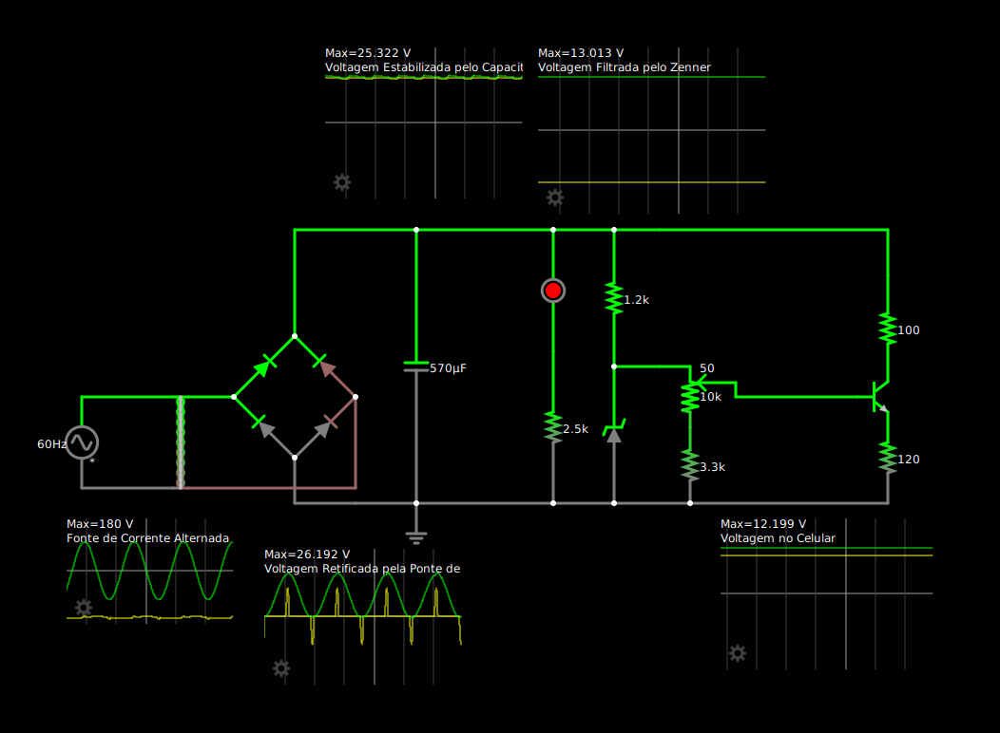

# Fonte de Tensão Ajustável
## Descrição da Atividade

Construção de uma fonte de tensão retificadora ajustável entre 3V e 12V com capacidade de 100mA. 

O circuito será feito a partir de uma corrente alternada de 127V (pico de 180V) de 60Hz.

## Alunos

* José Fausto Vital Barbosa - 15512767

* Pablo Henrique Almeida Vieira - 16895429

* Pedro Paulo Carvalho Coutinho - 16897011

* Roberto Brostel Barroso - 16899695

## Tabelas de Gastos

| Quantidade | Componente | Descrição | Valor |
|----------|----------|----------|----------|
| 1 | Transformador | 18 V | R$ 0,00 |
| 1 | Protoboard | <> | <> |
| 1 | Kit Jumper | <> | <> |
| 1 | Capacitor | <> | <> |
| 1 | Potenciômetro | 10 kΩ | <> |
| 1 | Resistor | <> | <> |
| 1 | Resistor | <> | <> |
| 1 | Resistor | <> | <> |
| 1 | Resistor | <> | <> |
| 1 | Resistor | <> | <> |
| 4 | Diodo | <> | <> |
| 1 | Diodo Zener | <> | <> |
| 1 | LED | <> | <> |
| 1 | Transistor | <> | <> |

Valor Total: R$ xx,xx

## Componentes Utilizados

### 🔌 Transformador 

abldaçhsfkjsf

### 🔲 Protoboard

### 🧵 Kit Jumper  

### ⚡ Capacitor     

 
### 🎚️ Potenciômetro    

### 🟫 Resistores

### 🔁 Diodos

### 🚫 Diodo Zener    

### 🔴 LED         

### ⚙️ Transistor       

## Circuito no Tinkercad

## Circuito Físico

Simulação do Circuito: https://tinyurl.com/2bozako4

## Vídeo Explicando o Circuito 

## Circuito no Fasltad

## Circuito no Eagle

## Circuito PCB

## Cálculo dos Componentes

### Cálculos Preliminares

Saída de tensão para o capacitor: $25,3$ V

Razão testada do transformador: $6,76$

Pico de Tensão A/C: $180$ V

### Voltagem no Capacitor ($V_c$)

Com base na razão ($R$) do transformador e na voltagem da rede ($V_{A/C}$), podemos calcular a tensão de saída do transformador ($V_t$):

$R = \frac{V_{A/C}}{V_t}$ $\Rightarrow$ $V_t = \frac{180}{6,76}$  $\therefore$  $V_t = 26,63$

Como cada diodo gasta ~0,7V e a corrente passa por 2 diodos em um mesmo sentido, faremos:

$V_c = V_t - 2\cdot0,7$ 

Então temos a voltagem no capacitor:

$V_c = 25,23$ V

### Cálculo do Ripple

Vamos usar a fórmula simples do Ripple do circuito para calcular qual deve ser a capacitância do capacitor. Para isso, vamos buscar um ripple de 10%.

Temos a fórmula:

$R_p = \frac{i}{f\cdot C}$  

Com base no simulador, temos uma corrente $i = 0,12 A$ passando pelo capacitor. Além disso, a frequência da rede é $f = 2*60 = 120$ Hz. Logo:

$\Rightarrow$  $0,1\cdot 25,23= \frac{0,12}{120\cdot C}

Portanto, conseguimos a capacitância que precisamos:

C = 396 $\mu$F $\approx 400 \mu F$

A capacitância mais próxima e maior que C que achamos foi de 570 $mu$F, então usamos ela.

 

