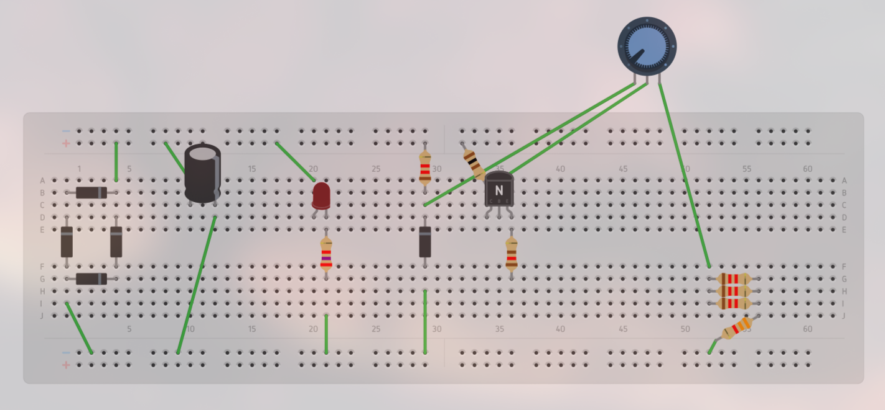

# Fonte de Tensão Ajustável
## Descrição da Atividade

Construção de uma fonte de tensão retificadora ajustável entre 3V e 12V com capacidade de 100mA. 

O circuito será feito a partir de uma corrente alternada de 127V (pico de 180V) de 60Hz.

## Alunos

* José Fausto Vital Barbosa - 15512767

* Pablo Henrique Almeida Vieira - 16895429

* Pedro Paulo Carvalho Coutinho - 16897011

* Roberto Brostel Barroso - 16899695

## Tabelas de Gastos

| Quantidade | Componente | Descrição | Valor Unitário |
|----------|----------|----------|----------|
| 1 | Protoboard | 840 pontos de conexão | R$ 39,10 |
| 1 | Kit Jumper | Macho-Macho + Macho-Fêmea | R$ 28,89 |
| 1 | Capacitor | 470 uF | R$ 0,44 |
| 1 | Potenciômetro | 10 kΩ, 1W | R$ 7,00 |
| 1 | Resistor | 2,7 kΩ, 1W | R$ 0,40 |
| 1 | Resistor | 3,3 kΩ | R$ 0,07 |
| 4 | Resistor | 1,2 kΩ | R$ 0,13 |
| 1 | Resistor | 100 Ω, 2W | R$ 1,20 |
| 1 | Resistor | 120 Ω | R$ 1,90 |
| 4 | Diodo Retificador | 1N4007 | R$ 0,20 |
| 1 | Diodo Zener | 13V, 1W | R$ 0,50 |
| 1 | LED | 5MM Difuso 333‑2SDRD/S530‑L | R$ 0,50 |
| 1 | Transistor | NPN BC338-25 | R$ 0,45 |

Valor Total: R$ 81,77

## Circuito no Tinkercad

## Funcionamento do Circuito Físico
### Circuito Físico

### Funcionamento
https://youtube.com/shorts/FkHjcjOaQXg?feature=share

## Vídeo Explicando o Circuito 
https://youtu.be/_wUiElhzMUA

Obs.: quando a explicação foi gravada, havia um resistor de 3.6k próximo ao potenciômetro, mas isso foi alterado para 3.7k na versão final do projeto.

## Circuito no Falstad

Simulação do Circuito: https://tinyurl.com/2bc8shob

Obs.: não conseguimos um resistor 3.7k para colocar próximo ao potenciômetro. Por conta disso, no circuito físico, nós colocamos 3 resistores de 1.2k em paralelo, os quais foram dispostos em série com um resistor de 3.3k. Dessa forma, conseguimos a resistência equivalente de 3.7k que precisávamos.

## Circuito PCB no Eagle
### Esquemático

### Board

## Cálculo dos Componentes

### Cálculos Preliminares

Saída de tensão para o capacitor: $25,3$ V

Razão testada do transformador: $6,76$

Pico de Tensão A/C: $180$ V

### Voltagem no Capacitor ($V_c$)

Com base na razão ($R$) do transformador e na voltagem da rede ($V_{A/C}$), podemos calcular a tensão de saída do transformador ($V_t$):

$R = \frac{V_{A/C}}{V_t}$ $\Rightarrow$ $V_t = \frac{180}{6,76}$  $\therefore$  $V_t = 26,63$

Como cada diodo gasta ~0,7V e a corrente passa por 2 diodos em um mesmo sentido, faremos:

$V_c = V_t - 2\cdot0,7$ 

Então temos a voltagem no capacitor:

$V_c = 25,23$ V

### Cálculo das Correntes

Vamos calcular as correntes a seguir com base na Primeira Lei de Ohm: $U = Ri$.

$i_{celular} = \frac{12,22}{120} \approx 101,8 mA$

$i_{LED} = \frac{25,44}{2700} \approx 9,4 mA$

$i_{zener} = \frac{25,44 - 13}{1200} \approx 10,3 mA$

$i_{potenciômetro} = \frac{25,44}{10,000 + 3,700 + 1,200} \approx 1,7 mA$

### Cálculo do Capacitância

Vamos usar a fórmula simples do Ripple do circuito para calcular qual deve ser a capacitância do capacitor. Para isso, vamos buscar um ripple de 10%.

Temos a fórmula:

$R_p = \frac{i}{f\cdot C}$  

Com base no simulador, temos uma corrente $i = 0,12 A$ passando pelo capacitor. Além disso, a frequência da rede é $f = 2\cdot 60 = 120$ Hz. Logo:

$\Rightarrow$  $0,1\cdot 25,23 = \frac{0,12}{120\cdot C}$

Portanto, conseguimos a capacitância que precisamos:

$C = 396,36$ $\mu F$

$C \approx 400$ $\mu F$

A capacitância mais próxima e maior que C que achamos foi de $470$ $\mu F$, então usamos ela.

 

