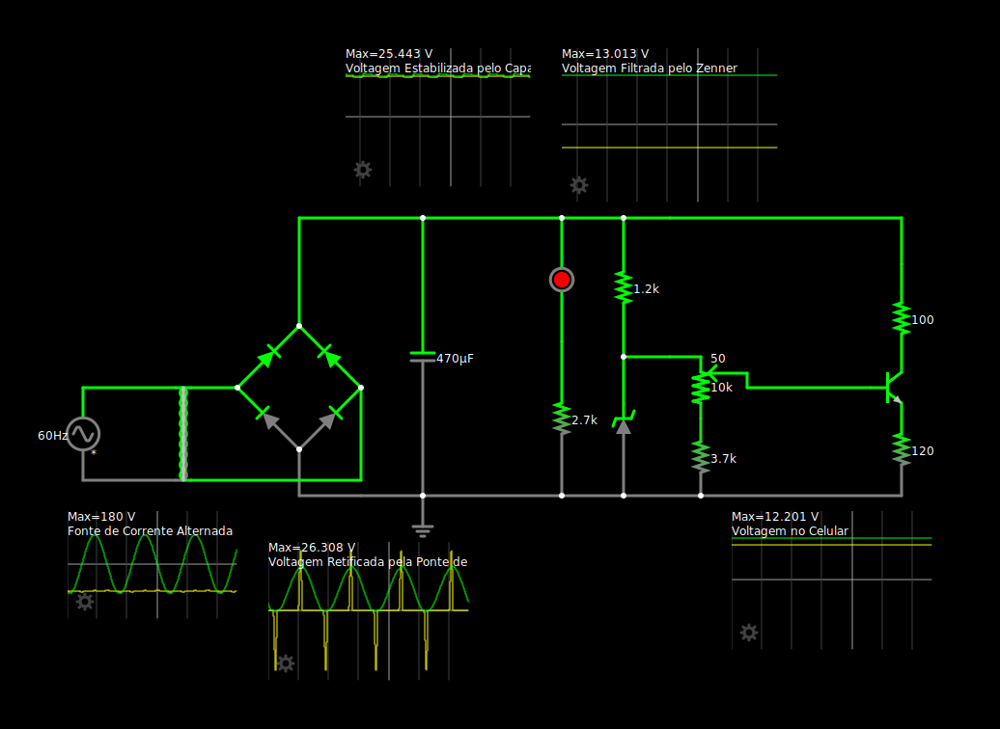

# Fonte de Tensão Ajustável
## Descrição da Atividade

Construção de uma fonte de tensão retificadora ajustável entre 3V e 12V com capacidade de 100mA. 

O circuito será feito a partir de uma corrente alternada de 127V (pico de 180V) de 60Hz.

## Alunos

* José Fausto Vital Barbosa - 15512767

* Pablo Henrique Almeida Vieira - 16895429

* Pedro Paulo Carvalho Coutinho - 16897011

* Roberto Brostel Barroso - 16899695

## Tabelas de Gastos

| Quantidade | Componente | Descrição | Valor |
|----------|----------|----------|----------|
| 1 | Transformador | 18 V | R$ 0,00 |
| 1 | Protoboard | <> | <> |
| 1 | Kit Jumper | <> | <> |
| 1 | Capacitor | <> | <> |
| 1 | Potenciômetro | 10 kΩ | <> |
| 1 | Resistor | <> | <> |
| 1 | Resistor | <> | <> |
| 1 | Resistor | <> | <> |
| 1 | Resistor | <> | <> |
| 1 | Resistor | <> | <> |
| 4 | Diodo | <> | <> |
| 1 | Diodo Zener | <> | <> |
| 1 | LED | <> | <> |
| 1 | Transistor | <> | <> |

Valor Total: R$ xx,xx

## Componentes Utilizados

### 🔌 Transformador 

abldaçhsfkjsf

### 🔲 Protoboard

### 🧵 Kit Jumper  

### ⚡ Capacitor     

 
### 🎚️ Potenciômetro    

### 🟫 Resistores

### 🔁 Diodos

### 🚫 Diodo Zener    

### 🔴 LED         

### ⚙️ Transistor       

## Circuito no Tinkercad

## Circuito Físico

Simulação do Circuito: https://tinyurl.com/2bozako4

## Vídeo Explicando o Circuito 

## Circuito no Fasltad

## Circuito no Eagle

## Circuito PCB

## Cálculo dos Componentes

Saída de tensão para o capacitor: $25,3 V$
